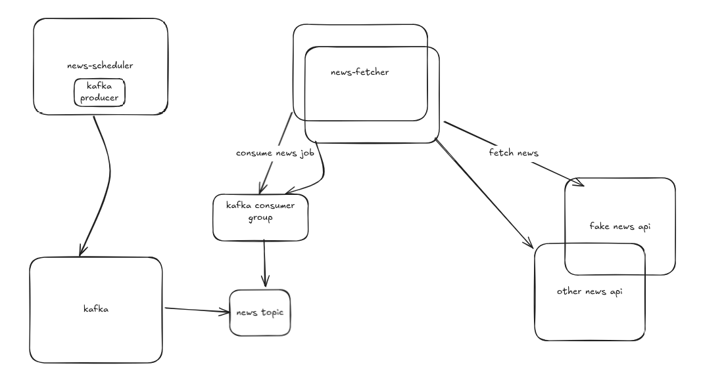
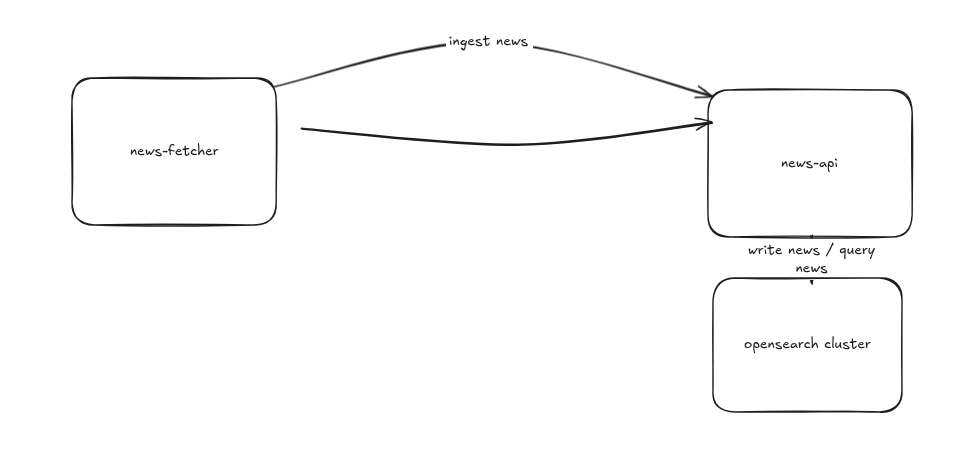
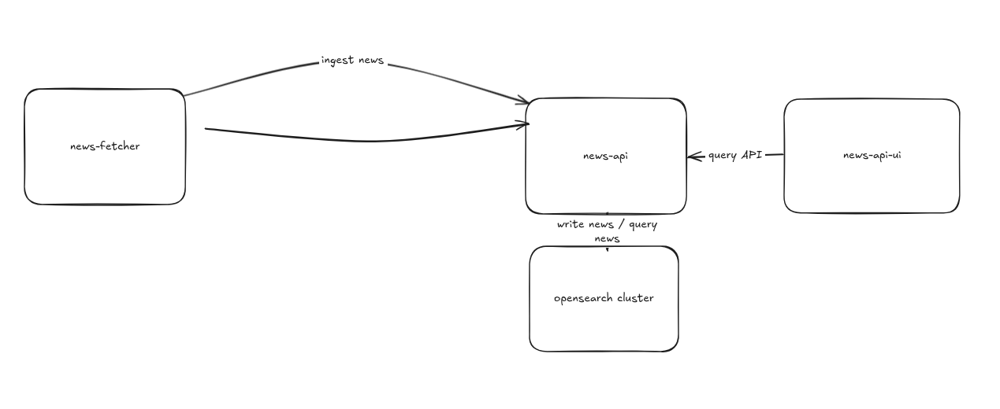
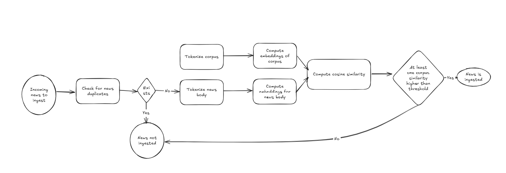
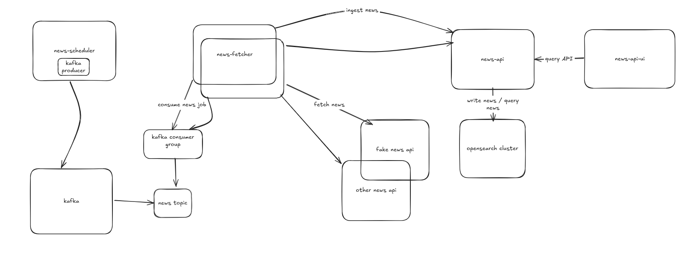

# news-ingestion-pipeline
The aim of this project is to build an ingestion pipeline for news. The system has to be able to ingest news on the fly, rank them and retrieve them.


## System design

### Data flow

#### Mocking news
The fake-news-api is a service acting as a dummy store for synthetic news.

#### Fetching news
Before ingesting the news, the system needs to fetch them (*this is assuming the news sources cannot push the updates to us).
To consume the news from the different APIs, we can have a service that will store references to news source to poll at a given frequency.

The news-scheduler service stores in memory a list of jobs(or references) to execute at a given time. When a news is to be fetched, a job containing the news information is run.

Example of a news fetching job:
```
{
	"id": "6305c04c-ee9c-4d11-980f-12391ac3186e",
	"name": "fake-news-api",
	"url": "http://fake-news-api:8000/api/news"
}
```

To distribute news fetching, we will leverage kafka, as it is a distributed event streaming platform. The news-scheduler service will act as a producer while we will have the news-fetcher instances acting as consumers.

Every instance of the news-fetcher is listening to a given topic. Upon receiving a new message, the fetcher will download the news from its source and validate the format.



#### Ingesting news
Once the news's content is downloaded, the news-fetcher will invoke the endpoint responsible for ingestion on the news-api. The news-api is the service responsible for
ingesting and querying news.



#### Making queries
Once the news are indexed in the database, we can make queries to retrieve them. To make it more user friendly, a simple streamlit app is available [here](#services).

The design for making queries will look like this at this point:


#### Ads filtering by relevancy
To measure relevancy of a news related to our IT managers interests, we use cosine similarity and embeddings.

The flow is as follow:
1. Check if the news is already in the index (news is not ingested if already present)
2. Tokenize the corpus sentences ("cybersecurity threats", "outage", "software bugs")
3. Compute embeddings for the tokenized corpus chunks
4. Tokenize the news body
5. Compute embeddings for the tokenized news body chunks
6. For each corpus sentence, we compute the cosine similarity with the news body embeddings.
7. Sort the corpus similarities.
8. If highest superior or equal to arbitrary threshold, then news is valid for ingestion, otherwise discarded.



#### Search / Retrieval of news
The design supports three ways of retrieving the news:
| Retrieval type | Description |
| -------------- | ----------- |
| keyword | Opensearch uses a BM25 algorithm to rank documents which basically gives higher points when the query terms are frequently used [more details](https://docs.opensearch.org/latest/search-plugins/keyword-search/). |
| semantic | The semantic search uses the embeddings computed to make an approximate knn search. More semantically close text chunks in news will have a higher cosine similarity and then rank higher in the result. |
| hybrid | The hybrid search leverages the semantic searches but add boosting to the result. The "published_at" field of the news is boosted to move news 1 day old higher in the reponse. |

### Data
NewsEmbeddings:
| Field | Type |
| ----- | ---- |
| chunk | str |
| embedding | list[float] |

NewsEmbeddings object example:
```
{
    "chunk": "blabla...",
    "embeddings": [1.5, 2.5, ...]
}
```

News:
| Field | Type |
| ----- | ---- |
| id | str |
| source | str |
| title | str |
| body | Optional[str] = None |
| embeddings | Optional[List[Embedding]] = None |
| published_at | datetime |

News object example:
```
{
    "id": "1",
    "source": "cyberweb",
    "title": "cybersecurity in the word is shifting",
    "body": "...",
    "published_at": "2025-01-01T00:00:00"
}
```
### High level design


## How to setup

### Pre-requisites
For the project to run, you will have to have [docker compose](https://docs.docker.com/compose/install/linux/) installed on your environment.

First, you will need [docker engine and docker-cli](https://docs.docker.com/engine/install/) installed.

### Starting / Shuting down
To start the project, run the following:
```
docker compose up --build
```

To stop it:
```
docker compose stop
```

### Kafka topic
First, the project has to be up.

#### List topics
To list existing topics, run the following command:
```
docker exec -it kafka kafka-topics.sh --list --bootstrap-server kafka:9092
```

#### Create topic
The project needs one kafka topic to be created. If you do not want to change the default ("news"), create it by doing:
```
docker exec -it kafka kafka-topics.sh --create --topic news --partitions 3 --bootstrap-server kafka:9092
```

### Kafka UI
Feel free to use Kafbat UI to see what is happening on the kafka level.
You can access it on http://localhost:8080

### Opensearch index
The different embeddings are stored on an opensearch index. To create it,
make a GET HTTP call on the endpoint http://localhost:8002/api/news/createIndex

### OpenAI API Key
You will need a valid OPENAI Api Key to run the project. Just replace the "REPLACE_BY_YOURS" in the docker-compose.yml file by your key.

## Technical details

### Opensearch

#### Index mapping
The following mapping was used for the opensearch index:
```json
{
    "settings": {
        "index": {
            "knn": true
        }
    },
    "mappings": {
        "properties": {
            "id": {
                "type": "text"
            },
            "source": {
                "type": "keyword"
            },
            "title": {
                "type": "text"
            },
            "body": {
                "type": "text"
            },
            "published_at": {
                "type": "date"
            },
            "embeddings": {
                "type": "nested",
                "properties": {
                    "embedding": {
                        "type": "knn_vector",
                        "dimension": 1536,
                        "method": {
                            "name": "hnsw",
                            "space_type": "cosinesimil",
                            "engine": "faiss"
                        }
                    },
                    "text_chunk": {
                        "type": "text"
                    }
                }
            }
        }
    }
}
```
It allows doing knn search with cosine similarity while also supporting keyword based queries. I assumed the news average content would be at worst a thousand characters, therefore storing the news body in each document is acceptable.

#### Search / Retrieval

##### Keyword
Default opensearch method for retrieving documents. It measures the occurences of terms in the documents and ranks them accordingly.

The query used to power the keyword search looks for the terms in the news body and title.
Title match will boost 3 times more than those in body.

Example of query assuming the query term is "cybersecurity" and the maximum number of documents to retrieve is 20:
```
{
    "query":
        {
            "multi_match": {
                "query": "cybersecurity",
                "fields": ["title^3", "body"]
            }
    },
    "size": 20
}
```

##### Semantic search
Find semantically similar news and the return the 20 best matches ordered by cosine similarity score.

Example of query with top 20 matches:
```
{
    "query": {
        "nested": {
            "path": "embeddings",
                "query": {
                    "knn": {"embeddings.embedding": {"vector": [1.0, ...], "k": 20}}
            },
        }
    }
}
```
##### Hybrid
Hybrid search leverages the semantic search while also boosting other fields. In this case, we give a boost of 100 points to news being published 1 day from the query time.
It will rank higher news that semantically match the query terms and that are recent (within one day). 

Example of query with top 20 matches:
```
{
    "query": {
        "bool": {
            "must": {
                "nested": {
                    "path": "embeddings",
                    "query": {
                        "knn": {
                            "embeddings.embedding": {
                                "vector": [1.0, ...],
                                "k": 20
                            }
                        }
                    },
                }
            },
            "should": [
                {
                    "range": {
                        "published_at": {
                            "boost": 100,
                            "gte": "now-1d/d"
                        }
                    }
                }
            ],
        }
    }
}
```

### Services
Find bellow the different services information.

| Service name  | Description | Openapi url |
| ------------  | ----------- | ----------- |
| fake-news-api  | A dummy api service exposing a few news.  | http://localhost:8000/docs |
| news-scheduler  | Service responsible for dispatching news jobs on kafka topic. It can either schedule news jobs or accept dynamic queries using its REST API  | http://localhost:8001/docs |
| news-fetcher | Service responsible for downloading news content. It is listening on kafka topics. | Not applicable |
| news-api | Service responsible for managing news, creating index and making searches | http://localhost:8002/docs |
| news-appi-ui | A little streamlit application to run different types of searches (keyword, semantic, hybrid) | http://localhost:8081/docs |
| kafba ui | Dashboard to interact with kafka cluster | http://localhost:8080 |
| opensearch | Document database to store vectors and run queries upon them | http://localhost:9200 |
| opensearch-dashboards | Dashboard to interact with opensearch indices - PS: username: admin, password: F*ax3Q(8t55O | http://localhost:5601 |


### Remarks / Possible improvements
#### Polling / Push
In the current design, the approach to get news was to do Polling. A better approach would be to have the different news api invoke our news-scheduler once a new news is avaible. It will avoid wasting resource on our side.

#### Scaling
Assuming we need to scale the system for high frequency updates, we could do several steps:
* Make one topic per news source
* Increase the number of members in the consumer group listening to the topic as long as the number of consumers in a group does not exceed the number of partitions

#### Detecting fake news
I think this could be handled by a dedicated Machine Learning model trained with features such as language patterns, sentiment analysis and source reliability.

#### Error handling
Error handling was kept to really the basis. The design did not dive in complex cases. For instance, once a news-fetcher fails to download the news content, should it commit the offset to kafka and skip the news or maybe push it to another retry alike topoc.

#### News scheduler
The news-scheduler uses a library called apscheduler and is relevant for simple design. But in the real word, we would need a more robust solution involving a broker (such as Celery) to not loose the state of the scheduled jobs in case of a failure. Also, in the current design, if we increase the number of workers for news-scheduler, the same scheduled jobs will run multiple times.